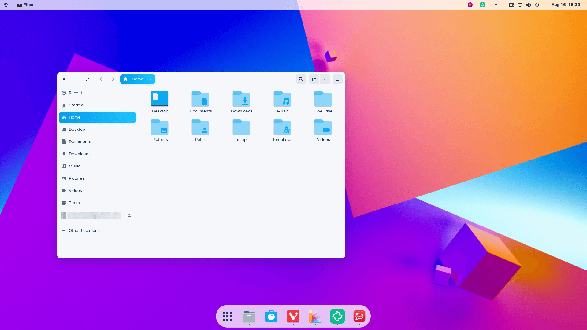
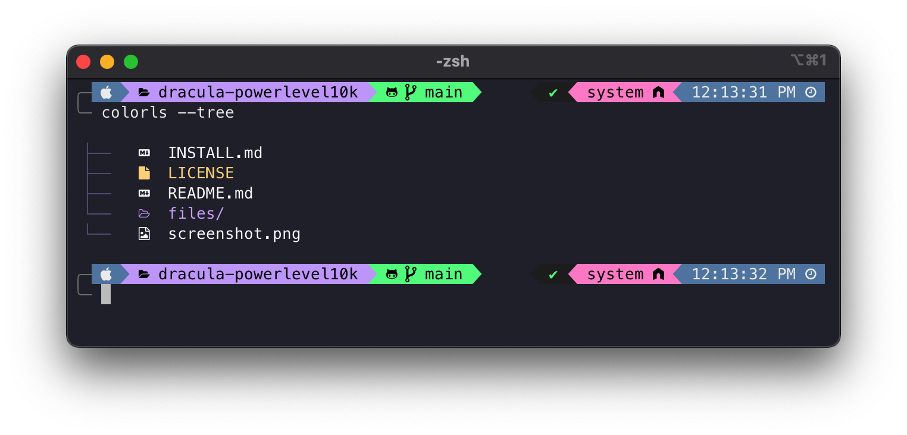



[Ubuntu](#ubuntu)も[Zorin OS](#zorinos)もLinuxと呼ばれるディストリビューションなわけなのだが、そんなLinuxを私が好む理由はいくつかある。

1. **オープンソース**：Linuxはオープンソースのオペレーティングシステムであり、誰でも自由にアクセスでき、改良することができます。これは、ソフトウェアの自由な利用を可能にし、コミュニティが共同でソフトウェアを開発することができるため、透明性とセキュリティの向上につながります。
2. **カスタマイズ性**：Linuxは、ユーザーがカスタマイズすることができる幅広いオプションを提供します。ユーザーは、自分の好みに合わせてデスクトップ環境、ウィンドウマネージャ、ターミナルエミュレータ、パッケージマネージャなどを選択することができます。
3. **安定性**：Linuxは、多くの場合、非常に安定して動作します。これは、コードがオープンソースであるため、多数の開発者が常にバグ修正やパフォーマンス向上に取り組んでいるためです。
4. **セキュリティ**：Linuxは、セキュリティに非常に優れています。これは、オープンソースであるため、多数の開発者がコードをレビューし、問題を修正することができるためです。また、Linuxは、標準的にセキュリティ機能が組み込まれているため、セキュリティの強化が容易です。
5. **コマンドラインツール**：Linuxは、強力なコマンドラインツールを提供します。これにより、複雑なタスクを効率的に実行することができます。また、これらのツールは、自動化やスクリプト化に適しているため、開発者やシステム管理者にとって非常に便利です。

こういった理由から多くのプログラムはLinuxベースで作成されることが多い。逆に<mark>Linuxに対応しないプログラムはこの世から消え去る運命にさえある</mark>といいと思う。


ただし、Linuxには学習コストがかかる場合があるため、WindowsやmacOSと比較して、初心者にとっては使いにくい場合もある。



## Ubuntu

まず、Linuxディストリビューションの中で最も人気のあるOSであろう。特にデスクトップ環境(GUI環境)も非常に洗練されていて初めて使うのであればこれが良い。そして何より情報が豊富である。

> 
> 
> <a name='ubuntu'>Ubuntu</a>（ウブントゥ[6]、[ʊˈbʊntuː] ( 音声ファイル); oo-BOON-too[7]）はDebian GNU/Linuxを母体としたオペレーティングシステム（OS）である。Linuxディストリビューションの1つであり、フリーソフトウェアとして提供されている。概念はディストリビューションも参照。カノニカルから支援を受けて開発されている。開発目標は「誰にでも使いやすい最新かつ安定したOS」を提供することである。 
> 
> — [Ubuntu - Wikipedia](https://ja.wikipedia.org/wiki/Ubuntu)


## Zorin OS

Zorin OSはUbuntuよりもよりデスクトップ環境に重きを置いている。



Zorin OS 16のデスクトップの写真であるが、非常に綺麗であろう。中身というかベースはUbuntuなのでLinuxでやりたいことは全てできる。

**できれば、Zorin OSを私は使いたい。**


> 
> 
> <a name='zorinos'>Zorin OS</a>（ゾーリンオーエス）は、UbuntuをベースとするLinuxディストリビューションである。2009年7月1日にバージョン1.0を提供開始した。当時12歳と14歳の少年が主になって製作した。Core版のデスクトップ環境はGNOMEベースであり、Lite版のデスクトップ環境はLXDEだったが、バージョン12でXfceに変更された。Core版ではWindows 7風のUIをデフォルトで提供していた。Windows XP風やGNOME 2風のデザインにすることも可能である。有料版としてPro (旧 Ultimate)が存在する。また、無料版にはCore、Lite、Educationが存在する。
> 
> アイルランドの首都ダブリンに拠点を構えるロシア系ウクライナ人エンジニアのアルチョム・ゾーリン(Артём Зорин)とキリル・ゾーリン(Кирилл Зорин)を中心に開発されている。
> 
> — [Zorin OS - Wikipedia](https://ja.wikipedia.org/wiki/Zorin_OS)

### VMで試した感想

Zorin OSは少し重い。

とは言ってもLinux自体軽いのでLinuxの中では重い類ということ。

---

ここからは、LinuxのOS内の設定をしていき、自分がよく使うツールが使えるようにしていく。

## Python

ここでは最新版である3.11はインストールしません。この理由については後日。

インストール方法は

1. `apt`を使用する方法

2. マニュアルでインストールする方法

の２つがある。どちらか好きな方でインストールするといい。


科学計算のためにPythonを使用する人の中にはAnacondaを推奨する者もいる。確かに1,500個以上のパッケージ、それを管理するパッケージ管理システムとcondaパッケージおよび仮想環境マネージャーなど沢山の便利な機能があり、オススメできる。しかしながら、**肥大化しがちで動作が重くなりやすい**。高性能なPCで無い場合やノートPCの場合はAnacondaではなく、**Python単体だけインストールして自分で必要なパッケージを一つ一つ入れて、パッケージ管理するのがいいだろう**。


### ①`apt`を使用する方法

端末から`apt`としてPythonをインストールできます。次のようにppaを追加し、Python 3.10バージョンをインストールします。

```bash
sudo add-apt-repository ppa:deadsnakes/ppa
sudo apt install python3.10
```

インストールが完了したら、以下のようにうまくインストールされていることを確認できます。

```shell
python3.10 --version
3.10.9
```

### ②マニュアルでインストールする

次のように`weget`でインストールファイルをダウンロードします。そして解凍してインストールします。

```bash
sudo apt install gcc make
```

ただし、`gcc`や`make`がインストールされていないと思われますので先にこちらのインストールを忘れずにしましょう。

```bash
wget https://www.python.org/ftp/python/3.10.9/Python-3.10.9.tgz
tar -xf Python-3.10.*.tgz
cd Python-3.10.*/
./configure --enable-optimizations
make -j $(nproc)
sudo make altinstall
```

インストールが完了したら、以下のようにうまくインストールされていることを確認できます。

```shell
python3.10 --version
3.10.9
```

### エイリアス設定をする

#### bashの人

`.bashrc`を開いて

```bash
alias python='python3.10'
alias pip='pip3.10'
```

などに設定しておくと良い。


#### fishの人

`.config/fish/config.fish`を開いて

```bash
alias python "python3.10"
alias pip "pip3.10"
```

などに設定しておくと良い。

---


## Julia


そもそもJuliaを知らない人のために

> **「Julia」とは、高度な計算や数値解析のできるスクリプト言語です。** マサチューセッツ工科大学の研究者Jeff Bezansonらによって2009年に開発され、2012年にオープンソース化されました。
>
> 開発者は、Juliaについて、ほかの言語のいいところだけを組み合わせることを目指した言語だと述べています。
> 例えば、C言語の速さやR言語の統計の扱いやすさ、Perlの自然な文字列処理、Matlabの線形代数などについて言及しています。そして、**完成したJuliaはPythonの汎用性を保ちながら、便利さや速さを従来の言語と比較して大幅に改善し、使いやすい言語になりました。**
>
> — [【入門編】プログラミング言語Juliaの特徴、メリット…｜Udemy メディア](https://udemy.benesse.co.jp/data-science/data-analysis/julia.html)

私はよく使うのでインストールします。

### インストール

まずは[公式ホームページ](https://julialang.org/)より、最新のバージョンを確認します。ダウンロードリンクを取得してきてください。それを`wget`します。

（別にコマンドラインではなく、クリックしてダウンロードしてもいいです。）

```bash
wget https://julialang-s3.julialang.org/bin/linux/x64/1.5/julia-1.5.2-linux-x86_64.tar.gz
tar -zxvf julia-1.5.2-linux-x86_64.tar.gz
sudo mv ~/julia-1.5.2 /opt/
```

### Pathを通す

```bash
"export PATH=/opt/julia-1.5.2/bin/:$PATH" >> .bashrc
```

#### ※「`>`」と「`>>`」について

「`>`」は、リダイレクト演算子と呼ばれます。リダイレクト演算子は、コマンドラインで実行されるコマンドの出力を、指定されたファイルに書き込むために使用されます。

たとえば、以下のようにして、「`ls`」コマンドの出力をファイルに書き込むことができます。

```bash
ls > file.txt
```

このコマンドは、「`ls`」コマンドの出力を「`file.txt`」という名前のファイルに書き込みます。ファイルが存在しない場合は新規に作成されます。また、既存のファイルに書き込む場合は、既存の内容が上書きされます。

他にも、「`>>`」というリダイレクト演算子もあります。この演算子は、「`>`」と同様に、出力をファイルに書き込むために使用されますが、既存のファイルに追記する場合に使用します。たとえば、以下のようにして、「`echo`」コマンドの出力を既存のファイルに追記することができます。

```bash
echo "Hello, World!" >> file.txt
```

このコマンドは、「`Hello, World!`」という文字列を既存の「`file.txt`」というファイルに追記します。

### Jupyter Notebookをインストールする

Jupyter NotebookにはデフォルとでIPythonカーネルが付属しているため、Pythonのセクションで話せばよかったのだが、これには理由がある。

JuliaはJITコンパイラを使用しているため、その強みを活かすにはJupyter notebookなどが最適なのだ。

`pip`なのか`pip3`なのか`pip3.10`なのか人によって違うと思うので確認してもらいたいが、ここでは統一して`pip`で進める。

```bash
pip install jupyter
```

これでインストール完了。

1. Juliaを起動する。

   ```bash
   Julia
   ```

   実行結果

   ```shell
                  _
      _       _ _(_)_     |  Documentation: https://docs.julialang.org
     (_)     | (_) (_)    |
      _ _   _| |_  __ _   |  Type "?" for help, "]?" for Pkg help.
     | | | | | | |/ _` |  |
     | | |_| | | | (_| |  |  Version 1.8.3 (2022-11-14)
    _/ |\__'_|_|_|\__'_|  |  Official https://julialang.org/ release
   |__/                   |
   
   ```

2. `]`を入力してパッケージモードを起動する。

3. `add IJulia`を入力してEnter。
   ついでに次のパッケージもインストールするとよい。

   ```julia
   add Plots
   add Optim
   add Latexify
   add LaTeXStrings
   add Polynomials
   add SpecialPolynomials
   add SpecialFunctions
   ```

4. バックスペースで元のREPLに戻る。

5. REPL上で次のように入力する。

   ```julia
   using IJulia; notebook(detached=true)
   ```

6. 少し待つと, 自動的にブラウザが起動する（はず）

これで完了である。

----


## bashからfish shellに変更する

Mac版は既に解説してますが、Linux版です。

### インストール

```bash
sudo apt-add-repository ppa:fish-shell/release-3
sudo apt-get update
sudo apt-get install fish
```

#### 確認

```bash
fish -v
```

実行結果

```shell
fish, version 3.2.0
```

### デフォルトのシェルを変更


`.bashrc`からfish shellを起動するようにしてもいいのですが、`bash`コマンドが無効化されることになるのでやめましょう！


```bash
chsh
```

実行結果

```shell
パスワード: 
    ------ のログインシェルを変更中
    新しい値を入力してください。標準設定値を使うならリターンを押してください
    ログインシェル [/bin/bash]: /usr/bin/fish
```

### fisherのインストール

```bash
curl -sL https://git.io/fisher | source && fisher install jorgebucaran/fisher
sudo apt-get install fonts-powerline
```

#### 確認

```bash
fisher -v
```

実行結果

```shell
fisher, version 4.3.0
```

fisherの便利な使い方は以下の記事で解説しているの参照してください。



### お好みのテーマにする

今回は私がハマってるテーマ「**tide**」を紹介する。




「zsh」のPowerlevel10kのスタイルが非常に魅了されたので、「fish」でも探したら「tide」という名前であったというわけです。



#### フォントのインストール

まずは先に「**Nerd font**」というのをインストールします。好みのフォントをダウンロード、解凍してOSに対応したフォントをインストールしてください。その後ターミナルアプリにフォントを設定してください。

https://www.nerdfonts.com/font-downloads


#### tideのインストール

```bash
fisher install IlanCosman/tide@v5
```

インストールができたら指示に従ってカスタマイズしていってください。

---

## TeX

ノートPCや普段使いのPCがWindowsの人はぜひLinuxに\\(\TeX\\)を入れよう。

Windowsのコンパイル速度に比べ、LinuxやmacOSは非常にコンパイル速度が速い。長い文章になればなるほど、Linuxに入れてよかったと思うはずだ。

**Winodowsユーザーよ、後悔したくなければLinuxにインストールせよ。**

### インストール

公式のUbuntuリポジトリはさまざまな種類のインストールパッケージを提供してくれている。

- texlive-base – 160 MB
- texlive-latex-recommended – 203 MB
- texlive – 269 MB
- texlive-latex-extra – 464 MB
- texlive-full – 5903 MB

fullでもいいのだが5GBもダウンロードするのは嫌なので、次のコマンドでインストールする。

```bash
sudo apt install texlive-lang-cjk
sudo apt install texlive-fonts-recommended
sudo apt install texlive-fonts-extra
```

### TeXstudioのインストール

次に\\(\TeX\\)を快適に使える環境を整えるのだが、TeXstudioをおすすめしている（いつかTeXstudio vs VScodeとかやりたい）。そのインストールは次の記事と同じなのでそれを参照されたい。


