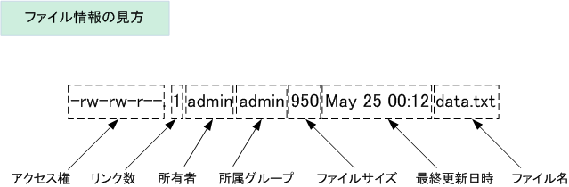
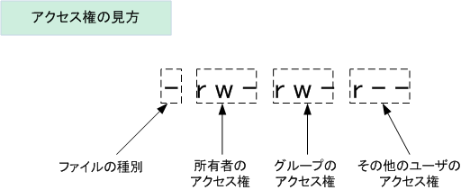
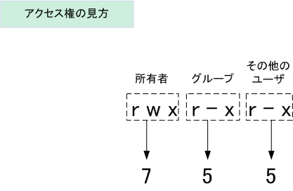

## はじめに

Linuxを使う上で、知っておくと便利な知識をまとめています。

基本的には、自分の優秀な後輩たちに向けて書いたつもりです。

## サーバーに接続

サーバ側がsshd(ssh daemon)が起動している場合は、sshコマンドを使って接続できます。

### ssh

基本形は以下の通りです。
```bash
ssh [user]@[host]
```

- `[user]`にはサーバ側に登録されているユーザー名を入れます。

- `[host]`にはサーバのホスト名、IPアドレス、ドメインなどを入れます。
  - ホスト名は、DNSサーバなどで変換されている必要がありますが、IPアドレスはそのまま使えます。
  - (ローカル)ネットワーク外から接続するには、グローバルIPアドレスが必要です。


sshコマンドの主なオプションは次の通りです。

| オプション        | 意味                                                                                                                      |
|-------------------|---------------------------------------------------------------------------------------------------------------------------|
| -p ポート番号     | 接続に使用するポート番号を指定する                                                                                        |
| -l ユーザー名     | 接続に使用するユーザー名を指定する                                                                                        |
| -i IDファイル     | 接続に使用する公開鍵ファイルを指定する                                                                                    |
| -C                | 全ての通信を圧縮する                                                                                                      |
| -c 暗号化方法     | 通信を暗号化する方法を指定する（「3des」「blowfish」「des」が指定可能）                                                   |
| -1                | SSHv1（SSHプロトコルバージョン1）だけを使用する                                                                           |
| -2                | SSHv2（SSHプロトコルバージョン2）だけを使用する                                                                           |
| -4                | IPv4だけを使用する                                                                                                        |
| -6                | IPv6だけを使用する                                                                                                        |
| -K                | GSSAPI（Generic Security Services API）による認証を許可する                                                               |
| -k                | GSSAPIによる認証を許可しない                                                                                              |
| -A                | 認証エージェントを転送する（1つ目のサーバに接続後、続けて別のサーバに接続する際に、最初に使った秘密鍵をそのまま使用する） |
| -a                | 認証エージェントを転送しない                                                                                              |
| -X                | X11のポートフォワーディングを有効にする（リモートマシンのXアプリケーションが実行できるようになる）                        |
| -x                | X11のポートフォワーディングを無効にする                                                                                   |
| -Y                | 信頼されたX11転送（Trusted X11）を有効にする                                                                              |
| -f                | コマンドを実行する際にsshをバックグラウンドにする（Xアプリケーションを実行する際に使用）                                  |
| -F 設定ファイル   | 設定ファイルを指定する                                                                                                    |
| -o 設定パラメータ | 設定パラメータを指定する（設定ファイルに書かれた内容より優先される）                                                      |
| -E ログファイル名 | エラーを指定したファイルに記録する                                                                                        |
| -q                | エラーメッセージや診断メッセージを表示しない（quiet mode）                                                                |
| -v                | デバッグメッセージを表示する（verbose mode）                                                                              |

## サーバーとクライアント間でファイルを転送する

サーバにあるファイルを、ローカルPCなどに持ってきたい時、逆にローカルPCにあるデータをサーバに転送したいときなどには`scp`コマンドが有効です。

### scp

基本形は以下のとおりです。

```bash
scp [転送元] [転送先]
```

例えば、サーバ(ここではIPアドレスを`xxx.xxx.x.x`で、ユーザー名は`user1`とします。)の`/home/user1/test.txt`というファイルをローカルPCの`/home/user2/`に転送する場合は、次のようになります。

```bash
scp user1@xxx.xxx.x.x:/home/user1/test.txt /home/user2/
```

`/home/user1/1.txt`と`/home/user1/2.txt`という２つ（複数）のファイル転送したい場合は連続して書けば問題ありません。例を以下に示します。

```bash
scp user1@xxx.xxx.x.x:/home/user1/1.txt user1@xxx.xxx.x.x:/home/user1/2.txt /home/user2/
```

### ワイルドカード

ただ、これでは面倒なので、ワイルドカードを使って、次のような書き方もできます。

```bash
scp user1@xxx.xxx.x.x:/home/user1/*.txt /home/user2/
```
- `*`: 任意の文字列を入れても良いという意味

```bash
scp user1@xxx.xxx.x.x:/home/user1/{1,2}.txt /home/user2/
```

- `{1,2}`: `{}`内の文字列のどれかを入れても良いという意味

ただ、注意として環境によっては、ワイルドカードの前に`\`が必要なのもあるそうです。

僕が持っているすべての環境で`\`は必要でした。

その場合は次のようになります。

```bash
scp user1@xxx.xxx.x.x:/home/user1/\*.txt /home/user2/
```

```bash
scp user1@xxx.xxx.x.x:/home/user1/\{1,2}.txt /home/user2/
```


## 現在のディレクトリを確認する

現在のディレクトリ（これを**カレントディレクトリ**、もしくは**ワーキングディレクトリ**といいます。）がどこかを確認するには、`pwd`コマンド(Print Working Directoryの略です。)を使います。

### pwd

基本形は以下の通りです。

```bash
pwd
```

## カレントディレクトリの移動

カレントディレクトリを移動するには、`cd`コマンド(Change Directoryの略です。)を使います。

### cd

基本形は以下の通りです。

```bash
cd [移動先のディレクトリ]
```

相対パスでも、絶対パスでも大丈夫です。

### 相対パス

相対パスは、現在のディレクトリを基準として、ファイルやディレクトリの場所を示す方法です。相対パスは、絶対パスとは異なり、ファイルやディレクトリの場所を完全に指定するのではなく、現在の場所からの相対的な位置を指定します。

相対パスは、次のような表現方法があります。

1. カレントディレクトリ: 「`.`」と表記します。たとえば、「``./index.html`」と表記すると、現在のディレクトリにある「`index.html`」というファイルを指します。

2. 親ディレクトリ: 「`..`」と表記します。たとえば、「`../images/picture.jpg`」と表記すると、現在のディレクトリの親ディレクトリにある「`images`」ディレクトリの中にある「`picture.jpg`」というファイルを指します。

3. 相対的なパス: 現在のディレクトリからの相対的なパスを指定することができます。たとえば、「`myfolder/index.html`」と表記すると、現在のディレクトリから「`myfolder`」ディレクトリを経由して、「`index.html`」というファイルを指します。

相対パスは、絶対パスよりも簡潔に表現できるため、こちらの方がよく使用されます。


### 絶対パス

絶対パスは、ルートディレクトリから始まるファイルやディレクトリの場所を示す方法です。絶対パスは、現在の場所に関係なく、常に同じファイルやディレクトリを指します。

絶対パスは、次のような表現方法があります。

1. ルートディレクトリ: 「`/`」(スラッシュ)と表記します。たとえば、「`/var/www/html/index.html`」と表記すると、ルートディレクトリから「`var`」ディレクトリ、その中の「`www`」ディレクトリ、そしてその中の「`html`」ディレクトリにある「`index.html`」というファイルを指します。

2. ホームディレクトリ: 「`~`」(チルダ)と表記します。たとえば、「`~/Documents/file.txt`」と表記すると、ユーザーのホームディレクトリにある「`Documents`」ディレクトリにある「`file.txt`」というファイルを指します。

絶対パスは、常に同じファイルやディレクトリを指し、相対パスよりも完全に指定されているため、より明確で正確な指定が可能です。ただし、長くて複雑な表現になる場合があるため、相対パスよりも煩雑な場合があります。

## ディレクトリ内一覧を確認する

`ls`コマンドを使用すると、現在のディレクトリ内のファイルとディレクトリの一覧を表示することができます。

### ls

基本形は以下の通りです。

```bash
ls [ディレクトリまたはファイル]
```

一般的なオプションには以下があります。

- `-l`: ファイルやディレクトリの詳細情報を表示します。
- `-a`: 隠しファイルや隠しディレクトリを含めて一覧を表示します。
- `-h`: ファイルサイズを人間が読みやすい形式で表示します。
- `-r`: 逆順に一覧を表示します。

例えば、以下のように入力すると、現在のディレクトリ内のファイルとディレクトリの一覧を表示できます。

```bash
ls
```

また、以下のように入力することで、詳細情報を含めた一覧を表示することができます。

```bash
ls -l
```

さらに、以下のように入力することで、特定のディレクトリ内のファイルとディレクトリの一覧を表示することができます。

```bash
ls /home/user1/
```

`ls`コマンドは、ファイルやディレクトリの一覧表示の他、様々なオプションを利用することで、より詳細な情報を取得することができます。

## ファイルの中身を見る

次のコマンドを使うと、ファイルの中身を見ることができます。

- `cat`: 中身すべてを表示する
- `head`: 最初10行を表示する
- `tail`: 末尾10行を表示する

### cat

基本形は以下の通りです。

```bash
cat [ファイル名]
```

### head

基本形は以下の通りです。

```bash
head [ファイル名]
```

10行とはいわず、任意の行数を表示したい場合は、`-n`オプションを使います。

```bash
head -n [行数] [ファイル名]
```

### tail

基本形は以下の通りです。

```bash
tail [ファイル名]
```

10行とはいわず、任意の行数を表示したい場合は、`-n`オプションを使います。

```bash
tail -n [行数] [ファイル名]
```

## ディレクトリをツリー構造で表示する

`tree`コマンドを使うと、ディレクトリをツリー構造で表示することができます。

### tree

基本形は以下の通りです。

```bash
tree [ディレクトリ]
```

[ディレクトリ]の部分は空白の場合はカレントディレクトリのツリーを表示します。

## ファイルがたくさんあるので限定したい

`grep`コマンドを使うと、ファイルの中から特定の文字列を検索することができます。

### grep

基本形は以下の通りです。

```bash
grep [検索文字列] [ファイル名]
```

`-r`オプションをつけると、ディレクトリ内のファイルを再帰的に検索します。

### パイプライン

`grep`コマンドは、他のコマンドと組み合わせて使うことができます。

例えば、`ls`コマンドで表示されたファイルの中から、特定の文字列を含むファイルを検索したい場合は、次のように入力します。

```bash
ls | grep [検索文字列]
```

他にも`tree`コマンドと組み合わせて利用することもできます。これで再帰的に探査することもできます。

```bash
tree -f | grep [検索文字列]
```

`tree`コマンドに`-f`オプションをつけると、 ディレクトリとファイル名も表示されるようになります。

## ファイルを作成する

`touch`コマンドを使うと、ファイルを作成することができます。

### touch

基本形は以下の通りです。

```bash
touch [ファイル名]
```

## ディレクトリを作成する

`mkdir`コマンドを使うと、ディレクトリを作成することができます。

### mkdir

基本形は以下の通りです。

```bash
mkdir [ディレクトリ名]
```

## ファイルを削除する

`rm`コマンドを使うと、ファイルを削除することができます。

### rm

基本形は以下の通りです。

```bash
rm [ファイル名]
```

オプションは以下の通りです。

| 短いオプション | 長いオプション     | 意味                                           |
|----------------|--------------------|------------------------------------------------|
| -f             | --force            | 存在しないファイルを無視する（確認も行わない） |
| -i             | --interactive      | 削除前に確認する                               |
| -v             | --verbose          | 経過を表示する                                 |
| -d             | --directory        | unlinkでディレクトリを削除する                 |
| -r,-R          | --recursive        | ディレクトリを再帰的に削除する                 |
|                | --preserve-root    | 「/」を削除しない（デフォルト）（※）           |
|                | --no-preserve-root | 「/」を特別なものとして扱わない（※）           |

また、ディレクトリを削除するときは`-r`オプションを追加します。

```bash
rm -r [ディレクトリ名]
```

## ファイルを編集する

以下のコマンドで、ファイルを編集することができます。

### vi

viは、UnixおよびLinuxシステムで最も一般的に使用されるテキストエディターの1つです。viは、コマンドラインで操作され、キーボードのみを使用してテキストを編集します。viは、テキストエディターとして非常に強力であり、様々な機能を備えています。ただし、初心者にとっては使い方が難しいと感じる場合があります。

### vim

vimは、viの拡張版であり、viと同じコマンドを使用しながら、より高度な機能を備えています。vimは、開発者やシステム管理者によく使用されます。vimには、様々なモードがあり、コマンドを入力する前に、iキーを押すことでインサートモードに入り、テキストを編集することができます。また、vimは、カラーコーディング、シンタックスハイライト、マクロ機能、プラグインなどの機能を備えています。

### nano

nanoは、viやvimと比べて、より簡単に使用できるテキストエディターです。nanoは、コマンドラインで操作されますが、viやvimとは異なり、テキスト編集のためのショートカットを提供します。nanoは、初心者にとっては非常に使いやすく、シンプルなテキスト編集に適しています。nanoは、カスタマイズ機能や高度な編集機能は少ないですが、基本的な編集には十分な機能を備えています。

---

## ユーザー関連のコマンド

- `whoami`: 現在のユーザー名を表示する
- `useradd`: ユーザーを追加する
- `userdel`: ユーザーを削除する
- `passwd`: パスワードを変更する
- `su`: ユーザーを切り替える
- `gpasswd`: グループ管理をする

### whoami

現在ログインしているユーザー名を表示するには、`whoami`コマンドを使います。

```bash
whoami
```

### useradd

基本形は以下の通りです。

基本的には`-m`オプションをつけることが多いかと思います。これによって、ホームディレクトリも作成されます。

```bash
useradd -m [ユーザー名]
```

主なオプションは次のようになります。

| 短いオプション  | 長いオプション          | 意味                                                         |
|-----------------|-------------------------|--------------------------------------------------------------|
| -m              | --create-home           | ユーザーのホームディレクトリが存在しない場合、作成する       |
| -M              | --no-create-home        | ユーザーのホームディレクトリを作成しない                     |
| -b              | --base-dir BASE_DIR     | ホームディクトリのベースとなるディレクトリ（/homeなど）      |
| -d ディレクトリ | --home-dir ディレクトリ | ユーザーのホームディレクトリ（通常はユーザー名と同じにする） |
| -k ディレクトリ | --skel ディレクトリ     | ひな型ディレクトリ（デフォルトは/etc/skel）を指定する（※2）  |


### userdel

基本形は以下の通りです。

基本的には`-r`オプションをつけることが多いかと思います。これによって、ホームディレクトリも削除されます。


```bash
userdel -r [ユーザー名]
```

### passwd

基本的には、`passwd`コマンドを実行すると、自分のパスワードを変更することができます。

ユーザー名を指定すると、そのユーザーのパスワードを変更することができます。

```bash
passwd [ユーザー名]
```

| オプション         | 意味                                                                                                                                      |
|--------------------|-------------------------------------------------------------------------------------------------------------------------------------------|
| -l       | 指定したユーザーをロックする                                                                                                              |
| -u       | 指定したユーザーのロックを解除する                                                                                                        |
| -d       | パスワードを削除する                                                                                                                      |
| -S       | パスワードの状態を表示する                                                                                                                |
| -n 日数  | パスワード変更後、再度変更可能になるまでの日数を設定する                                                                                  |
| -x 日数  | パスワードが有効な日数を設定する                                                                                                          |
| -w 日数  | パスワード失効前に警告を表示する日数を設定する                                                                                            |
| -i 日数  | パスワードが有効期限に達した後、パスワードを無効にするまでの猶予期間を設定する （これ以上期限切れのままにしているとログインできなくなる） |
| --stdin            | 新しいパスワードを標準入力から読み込む                                                                                                    |


### su

基本形は以下の通りです。

```bash
su [-] [ユーザー名]
```

引数に「-」を付けると、そのユーザーの環境変数（PATHなど）を引き継ぎます。

ユーザーのホームへ移動もしてくれます。

スーパーユーザへの切り替えは、root権限のあるユーザーから以下のコマンドを実行します。

```bash
sudo su [-]
```

もしくは

```bash
sudo -s/-i
```

です。こっちのほうが今風らしい。

### gpasswd

基本形は以下の通りです。

```bash
gpasswd [オプション] [ユーザー名] [グループ名]
```

#### sudo権限を与えたい

```bash
gpasswd -a [ユーザー名] sudo
```

#### sudo権限を剥奪したい

```bash
gpasswd -d [ユーザー名] sudo
```

オプションは以下のとおりです。

| 短いオプション | 長いオプション            | 意味                                                 |
|----------------|---------------------------|------------------------------------------------------|
| -a ユーザー    | --add ユーザー            | ユーザーをグループに所属させる                       |
| -d ユーザー    | --delete ユーザー         | ユーザーをグループのメンバーから外す                 |
| -r             | --delete-password         | グループのパスワードを削除する                       |
| -R             | --restrict                | グループへのアクセスをメンバーのみに制限する         |
| -A ユーザー    | --administrators ユーザー | グループの管理者を設定する（ユーザーは複数指定可能） |
| -M ユーザー    | --members ユーザー        | メンバーのリストを設定する（ユーザーは複数指定可能） |

---

## パーミッション関連のコマンド

- `ls -l`: パーミッションを確認する
- `chmod`: パーミッションを変更する

### ls -l

`ls`コマンドはすでに説明していますが、特にここでは`ls`コマンドに`-l`オプションをつけることで、パーミッションを確認することができることについて言及します。

ディレクトリ内のファイル／ディレクトリのパーミッションを確認する場合は以下のとおりです。

```bash
ls -l
```

また、隠しファイルも含めてすべて確認する場合は以下のとおりです。

```bash
ls -la
```

ここでは、`-l`オプションと`-a`オプションを組み合わせています。

また、特定のファイルのみのパーミッションを確認する場合は以下のとおりです。

```bash
ls -l [ファイル名]
```

とりあえず、実行すると次のように表示されます。

```
drwxrwxr-x  5 nishihama nishihama 4096  7月 28 16:09 .vscode-server/
-rw-rw-r--  1 nishihama nishihama  183  7月 15 16:09 .wget-hsts
drwxrwxr-x 28 nishihama nishihama 4096  6月 26 15:19 anaconda3/
```
最初の文字がパーミッション(アクセス権)を表しています。



アクセス権は次のように構成されています。



ファイルの種別の表示は3つあり「 - 」はファイル、「 d 」はディレクトリ、「 l 」はリンクを表します。

また、アクセス権は数値で表すことができます。下表のとおり、読み取り（r = 4）、書き込み（w = 2）

実行（x = 1）であることが分かります。つまり全権限（rwx）は「4+2+1=7」であることが分かります。

| 記号表記 | 2進数 | 8進数 |
|----------|-------|-------|
| `---`      | 000   | 0     |
| `--x`      | 001   | 1     |
| `-w-`      | 010   | 2     |
| `-wx`     | 011   | 3     |
| `r--`     | 100   | 4     |
| `r-x`      | 101   | 5     |
| `rw-`     | 110   | 6     |
| `rwx`      | 111   | 7     |



そして、このアクセス権をパーミッション755と表記します。

### chmod

基本形は以下の通りです。

```bash
chmod [パーミッション] [ファイル名]
```

もしくは次のような演算形式で書きます。

| カテゴリー | 説明             |
|------------|------------------|
| u          | 　所有者         |
| g          | 　グループ       |
| o          | 　その他のユーザ |
| a          | 　全てのユーザ   |

| 定義 | 説明               |
|------|--------------------|
| +    | 　アクセス権の追加 |
| -    | 　アクセス権の削除 |
| =    | 　アクセス権の指定 |

| 権限 | 説明                 |
|------|----------------------|
| r    | 　読み取り権限       |
| w    | 　書き込み権限       |
| x    | 　実行権限           |
| s    | 　SUID または SGID   |
| t    | 　スティッキービット |

例えば、以下のように使います。

```bash
chmod go+w testdata.txt
```
groupとotherのパーミッションにwriteのアクセス権を追加しました。

### chown

所有権を変更します。

