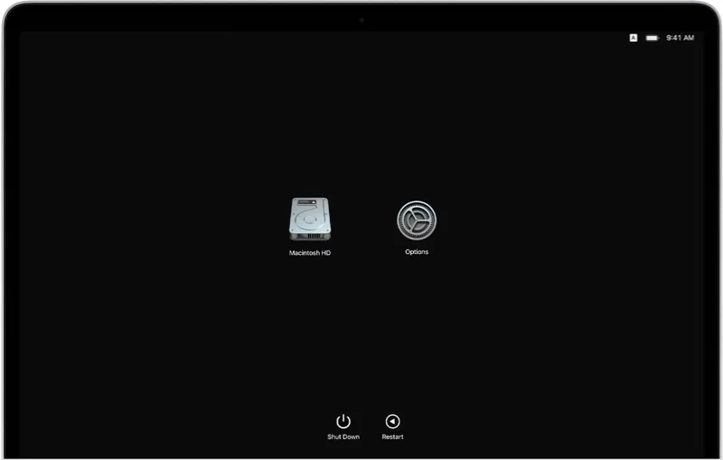
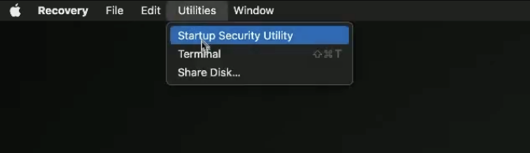
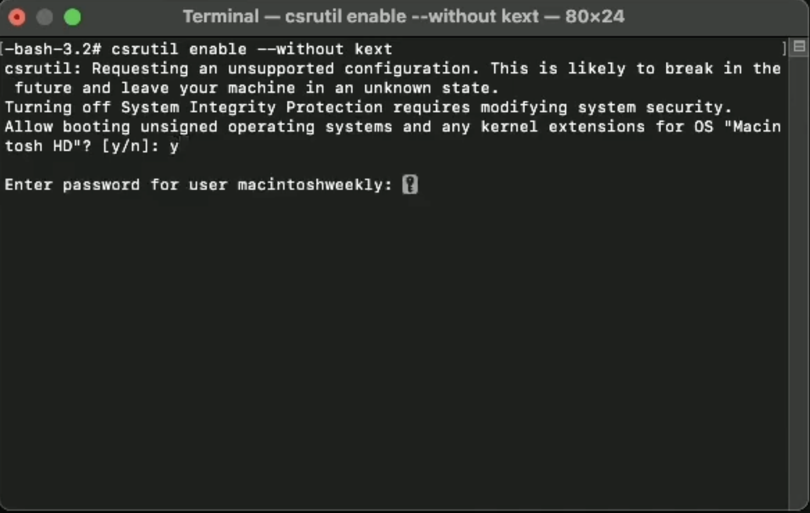
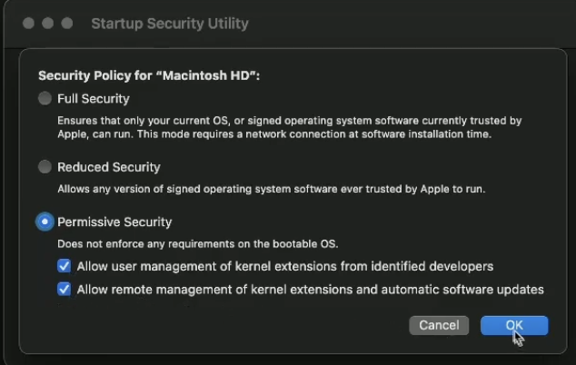
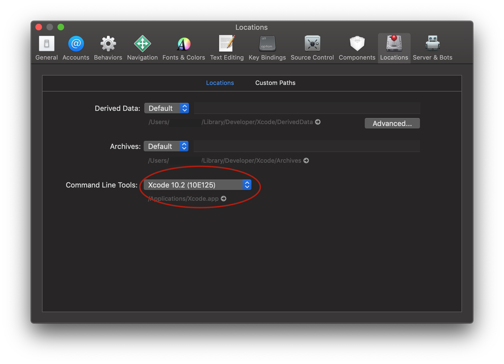
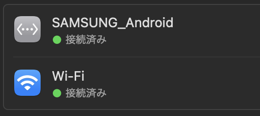

## Introduction

At some point, Macs quit supporting USB tethering.

WiFi tethering is faster than Bluetooth tethering, but it drains the battery. This was a significant bottleneck. I still wanted to use USB tethering, so I lowered the security level of my Mac and attempted to build my own build for my environment to support USB tethering.


### My environment

- Macbook Air 2020 (M1 Chip, Ventura 13.3.1)
- Android phone: Galaxy S21


## Procedure

### 1. lower the security level

Boot your Mac into Recovery Mode and open Terminal.

Press and hold Touch ID (power button) for a few seconds and wait until you see "Loading boot options" and the boot disk selection screen will appear.



Select "Options" next to "Macintosh HD."



Select Terminal and type the following command.

```bash
csrutil enable --without kext
````

Then press y, press allow, and enter your password.



Once this is done, close Terminal, select "Startup Security Utility" and choose "Security Policy."



Then, give them all permissions.

Now you have reduced the security level.

### 2. build HoRNDIS using Xcode

First, download the HoRNDIS source code.

```bash
git clone --recursive https://github.com/jwise/HoRNDIS.git
```

Go into the downloaded directory and type the build command.

```bash
cd HoRNDIS
xcodebuild -sdk macosx -configuration Release
````

When I tried to build, I got the following error in my environment.

```
xcode-select: error: tool 'xcodebuild' requires Xcode, but active developer directory '/Library/Developer/CommandLineTools' is a command line tools instance
````

So, install Xcode here and go to [Xcode] → [Preferences...] on the menu bar and select [Locations...]. and select [Locations] from [Xcode] → [Preferences...] in the menu bar, and select the appropriate one for [Command line Tools:] in Xcode. Now you can build.



When the build is done, let's copy it to the extensions directory.

```bash
sudo cp -rv build/Release/HoRNDIS.kext /Library/Extensions/
```

Now you can approve the HoRNDIS kernel from Settings > Privacy and Security, reboot, and you can use USB tethering.

