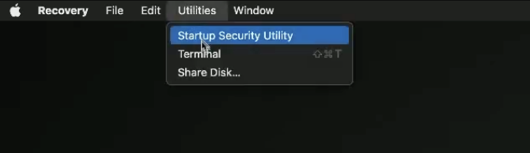
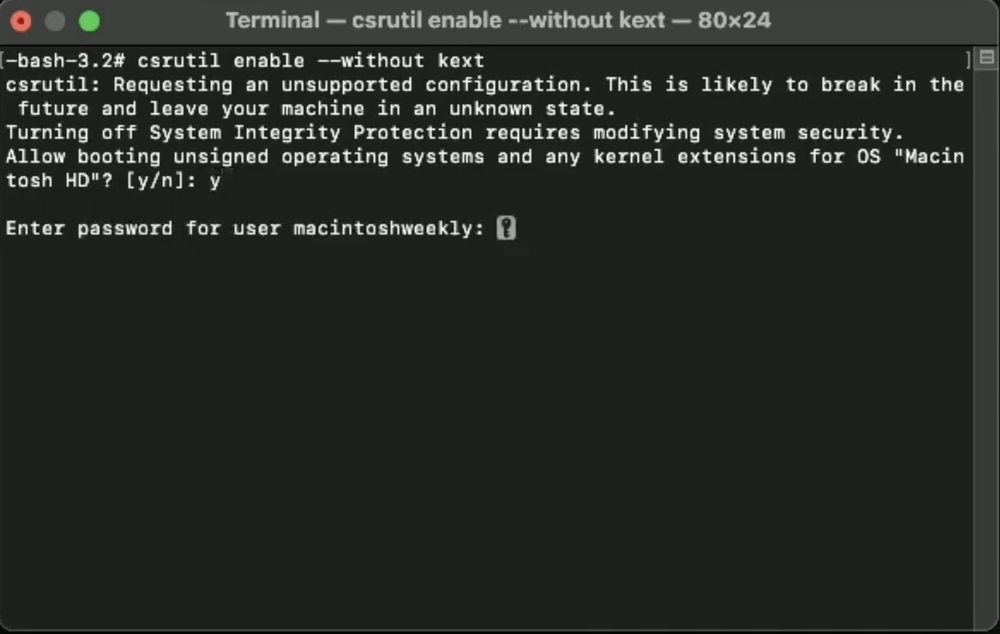
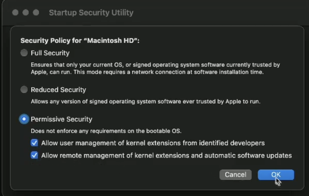
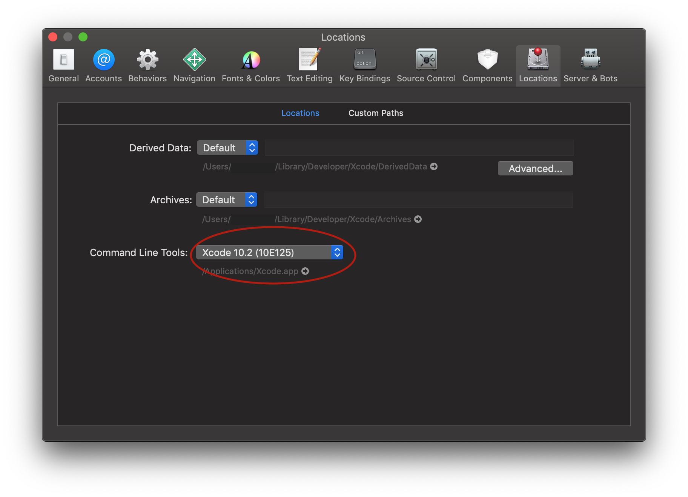

## はじめに

MacはあるときをきっかけにUSBテザリングのサポートを辞めました。

WiFiテザリングはBluetoothテザリングに比べて高速ではあるのですが、電池を消耗します。これはかなりのネックでした。やはりUSBテザリングを使いたいと思い、Macのセキュリティレベルを下げ、自分の環境用に自力でビルドしてUSBテザリングに対応させようという試みです。


### 私の環境

- Macbook Air 2020 (M1 Chip, Ventura 13.3.1)
- Androidスマホ: Galaxy S21

---


## 手順

### 1. セキュリティレベルを下げる

Macをリカバリーモードで起動してTerminalを開きます。

Touch ID (電源ボタン) を数秒間押し続けて、「起動オプションを読み込んでいます」と表示されるまで待つと、起動ディスクの選択画面が現れます。


「Macintosh HD」の横にある「オプション」を選択します。



Terminalを選択して以下のコマンドを入力します。

```bash
csrutil enable --without kext
```

そしたら、yを押して許可を押してパスワードを入力してください。



これが完了したらTerminalは閉じて、「起動セキュリティユーティリティ」を選択して、「セキュリティポリシー」を選びます。



そして、すべて許可をしてあげてください。

これでセキュリティレベルを下げることができました。

### 2. Xcodeを用いてHoRNDISをbuildする

まずHoRNDISのソースコードをダウンロードする。

```bash
git clone --recursive https://github.com/jwise/HoRNDIS.git
```

ダウンロードしたディレクトリの中に入ってbuildコマンドを打つ。

```bash
cd HoRNDIS
xcodebuild -sdk macosx -configuration Release
```

buildしようとすると、私の環境では以下のようなエラーが出た。

```
xcode-select: error: tool 'xcodebuild' requires Xcode, but active developer directory '/Library/Developer/CommandLineTools' is a command line tools instance
```

なので、ここでXcodeをインストールしてメニューバーの[Xcode] → [Preferences...]から[Locations]を選択して、[Command line Tools:]をXcodeの適切なものを選択してあげる。これでビルドができる。



buildができたら拡張機能のディレクトリにコピーしてあげよう。

```bash
sudo cp -rv build/Release/HoRNDIS.kext /Library/Extensions/
```

これで「設定」→「プライバシーとセキュリティ」からHoRNDISカーネルを承認してあげて、再起動するとUSBテザリングが使えるようになる。


