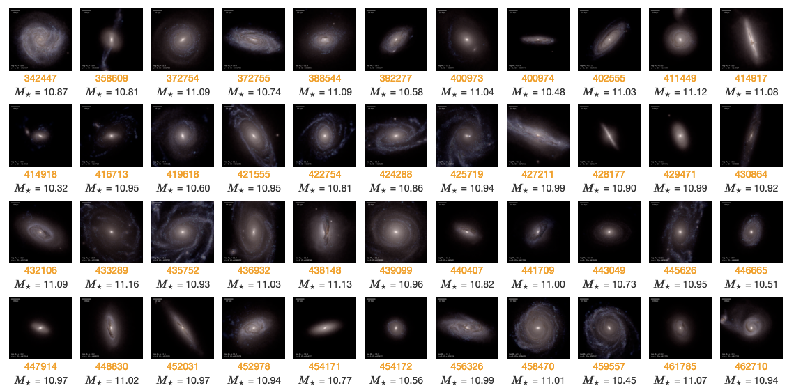
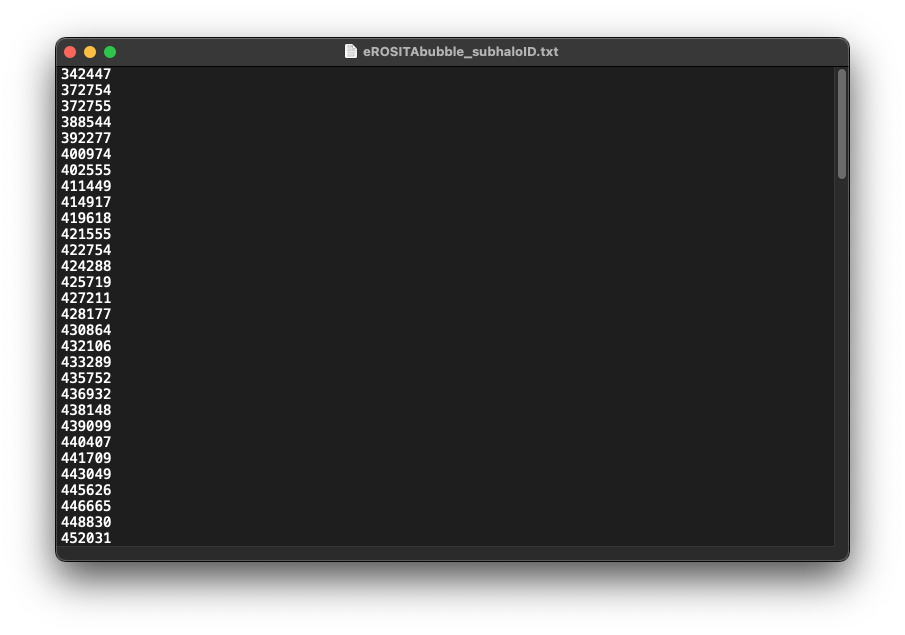
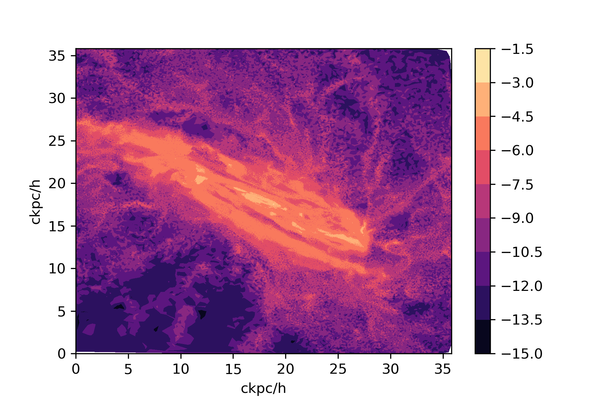

[TNG_catcher](../tng_catcher)/[TNG_catcher.extract_subhalo_data](../tng_catcher.extract_subhalo_data/)

---

次の一行でモジュールを読み込みます。

```python
from TNG_catcher import *
```

このモジュールは次のクラスが定義されてあります。

- extract_subhalo_data
- （順次作成中）

## はじめに

Illustris-TNGのサイトには、様々な銀河のカタログが公開されています。



そこでこれらを簡単に取得したい／解析したいと思い、このモジュールを作成しました。

### ファイル構造

```
📦 .
├─ sims.TNG
│  ├─ TNG50-1
│  │  ├─ output
│  │  │  ├─ groups_000
│  │  │  │  ├─ fof_subhalo_tab_000.0.hdf5
│  │  │  │  └─ ...
│  │  │  ├─ groups_001
│  │  │  ├─ ...
│  │  │  ├─ groups_099
│  │  │  ├─ snapdir_000
│  │  │  │  ├─ snap_000.0.hdf5
│  │  │  │  └─ ...
│  │  │  ├─ snapdir_001
│  │  │  ├─ ...
│  │  │  ├─ snapdir_099
│  │  │  ├─ subbox0
│  │  │  ├─ subbox1
│  │  │  ├─ subbox2
│  │  │  └─ txt-files
│  │  └─ postprocessing
│  │     ├─ offsets
│  │     │  ├─ offsets_000.hdf5
│  │     │  └─ ...
│  │     ├─ SubboxSubhaloList
│  │     │  ├─ subbox0_67.hdf5
│  │     │  └─ ...
│  │     ├─ tracer_tracks
│  │     │  ├─ tr_all_groups_99_meta.hdf5
│  │     │  └─ ...
│  │     └─ trees
│  │        ├─ LHaloTree
│  │        ├─ SubLink
│  │        └─ SubLink_gal
│  ├─ TNG100-1
│  └─ TNG300-1
├─ Illustris_python
├─ TNG_catcher.py
└─ [実行ファイル].ipynb
```

## SubHaloもしくはHaloのデータを用意する

クラス`extract_subhalo_data`を使います。基本的にはSubHaloのデータを持ってこれるように開発をしました。

しかし、SubHaloだけでなくHaloデータも持ってこれれば便利だなということで、このクラスでHaloデータも持ってこれるようにしてあります。

### インスタンスを作成


```python
test = extract_subhalo_data('./sims.TNG/TNG50-1/output')
```

    The following Module installed.


シミュレーションデータが入っている`output`ディレクトリを参照するように`extract_subhalo_data('./sims.TNG/TNG300-1/output')`と入力します。

このパスを`basePath`と呼ぶことにします。

このときに`extract_subhalo_data`が必要とするモジュールが読まれます。なのでモジュールエラーが出る場合は、モジュールの対応を読んでください。

この状態ではデフォルトの設定状態になっており、すでに実行ができる（簡単なお試しができる）ようにしてあります。

### 実行する

#### `run()`メソッド

`test.run()`実行すると、`test.info()`で確認できる情報のデータを取ってきます。


```python
test.info()
```

    fields:  ('Coordinates', 'Masses')
    ## You can set fields of here: https://www.tng-project.org/data/docs/specifications/#parttype0
    
    basePath: 		 		./sims.TNG/TNG50-1/output
    snapnum: 		 		99
    FoFnum: 		 		0.5
    plottype: 		 		0
    output_dirname: 	 	cut_data
    output_file_format: 	npz
    is_subhalo: 		 	True
    subhalolist: 		 	[342447]


`test.run()`をすると、`./cut_data`というディレクトリが作成され、そこに出力されるようになっています。

データファイルの命名規則は`[subhalo or halo][subhaloID or haloID]_data.npz`です。

※subhaloIDは6桁表示、haloIDは3桁表示です。

この命名規則を変更するメソッドは用意しておりませんので、ご了承ください。


```python
test.run()
```

    Complete output:  342447
    #### Complete all output ####

```python
test.run(cut=False)
```

- `cut`: データを切り取るかどうか。デフォルトは`False`です。
  - `True`にすると、データを切り取ります。`False`にすると、データを切り取りません。
  - `False`のとき、FoFnumは無視されます。


### 取得したいsubhalo IDを設定する

用意しているメソッドは

- `get_list`
- `set_list`

です。

#### `get_list()`メソッド

こちらのメソッドは取得したいsubhalo IDが大量にある場合に便利です。

`TXT`ファイルなどにsubhalo IDを列挙してください。

ここでは`eROSITAbubble_subhaloID.txt`に列挙します。



1行1つのIDとして認識します。

このファイルを読み込む際は`get_list(__Path__)`で読み込めます。


```python
test.get_list("eROSITAbubble_subhaloID.txt")
```


**注意** 数字以外の文字列が含まれている場合はstr型として認識されるため、エラーが出ます。必ず数字のみのファイルにしてください。


#### `set_list()`メソッド

こちらのメソッドはsubhaloIDをリストで入力します。

たとえばsubhaloIDが372754のものだけ欲しい場合は次のように設定します。


```python
test.set_list([372754])
```

必ず`list`形式で入力しないとエラーがでます。

### スナップショットを設定する

スナップショット（赤方偏移に対応、z=0はsnapnumは99です）を変更（設定）するには次のメソッドを用います。

#### `set_snapshot()`メソッド

```python
test.set_snapshot(99)
```

### Haloデータを取得する

Haloデータを取得するには、設定を変更しなくてはいけません。このとき使用するのが、`change_subhalo_mode()`メソッドです。

#### `change_subhalo_mode()`メソッド

```python
test.change_subhalo_mode(False)
```

    Mode: Halo
    The only ID to set with `get_list` and `set_list` is the Halo ID; if you want to make it a Subhalo ID, change it to **True**.

ModeがHaloになっていることを確認してください。

ただし、開発はsubhaloがメインですので、バグが発生する場合があります。

subhaloのモードに戻すには

```python
test.change_subhalo_mode(True)
```

    Mode: Subhalo
    The only ID to set with `get_list` and `set_list` is the Subhalo ID; if you want to make it a Halo ID, change it to **False**.

で戻せます。

```python
test.change_subhalo_mode()
```
でデフォルト状態、つまり`True`が代入された状態に戻すこともできます。

### 取得したいデータを設定する

以下のURLのCONTENTS欄より、取得したいデータ名を参照してください。

https://www.tng-project.org/data/docs/specifications/

取得したいデータは`set_fields()`メソッドで設定します。

#### `set_fields()`メソッド

`set_fields()`メソッドはlist形式で入力してもいいですし、直接引数に入力しても問題ありません。どちらであっても同じ挙動をします。

```python
# list形式
fields=["Coordinates",
         "Density",
         "ElectronAbundance",
         "GFM_Metals",
         "InternalEnergy",
         "Masses"]

test.set_fields(fields)

# 直接引数に入力
test.set_fields("Coordinates", "Density", "ElectronAbundance", "GFM_Metals", "InternalEnergy", "Masses")
```

    ('x',
    'y',
    'z',
    'Density',
    'ElectronAbundance',
    'H',
    'He',
    'C',
    'N',
    'O',
    'Ne',
    'Mg',
    'Si',
    'Fe',
    'MetalTotal',
    'InternalEnergy',
    'Masses')

多次元配列のデータは1次元のデータに変換されます。

例えば、`Coordinates`は3次元のデータですが、`x`, `y`, `z`の3つのデータに変換されます。`GFM_Metals`は10次元のデータですが、`H`, `He`, `C`, `N`, `O`, `Ne`, `Mg`, `Si`, `Fe`, `MetalTotal`の10つのデータに変換されます。

これによって多次元配列のデータを扱いやすくしています。

またそれと同時に、多次元配列のデータには非対応のデータも存在します。それは以下の通りです。

#### 非対応フィールド

以下のフィールドについては非対応です。`run()`を実行すると、エラーが表示されます。

- PartType 0 (gas)
  - なし
- PartType 1 (dm)
  - なし
- PartType 3 (tracers)
  - なし
- PartType 4 (stars / wind particles)
  - BirthPos
  - BirthVel
  - GFM_StellarPhotometrics
- PartType 5 (black holes)
  - なし

※順次対応していく予定です。

### 出力データ形式

出力データ形式はデフォルトでは`npz`形式になっています。


**`npz`形式とは？**

npz形式は、NumPyの配列を保存するためのファイル形式の一つです。NumPyは、科学技術計算を行うためのPythonの拡張モジュールであり、多次元配列を扱うことができます。npz形式は、NumPyの配列を圧縮して保存することができ、複数の配列を一つのファイルに保存することもできます。


変更するには`set_output_file_format()`メソッドを用います。例えばcsv形式に変更するには次のようにします。

#### `set_output_file_format()`メソッド

```python
test.set_output_file_format("csv")
```

大量のデータとなることが予想されるため、`csv`形式は非推奨です。
また対応済みのフォーマットは以下のとおりです。
- npz
- csv

#### 保存したデータを読み取る(example scripts)

```python
import numpy as np
import matplotlib.pyplot as plt
dd = np.load("cut_data/subhalo342447_data.npz")
dd.files
```

    ['x',
    'y',
    'z',
    'Density',
    'ElectronAbundance',
    'H',
    'He',
    'C',
    'N',
    'O',
    'Ne',
    'Mg',
    'Si',
    'Fe',
    'MetalTotal',
    'InternalEnergy',
    'Masses']

```python
x,y,z = dd['x'], dd['y'], dd['Density']
plt.tricontourf(x-min(x),y-min(y),np.log(z),cmap="magma")
plt.xlabel("ckpc/h")
plt.ylabel("ckpc/h")
plt.colorbar()
plt.savefig("test.png",dpi=300)
```




### subhaloの範囲を変更する

subhaloの範囲を変更するには、`set_FoF()`メソッドを用います。

#### `set_FoF()`メソッド

```python
test.set_FoF(1)
```

デフォルトでは`0.5`が設定されています。

数字が大きくなればなるほど範囲が大きくなるので、大量のデータを保存する必要が出てきますので、注意してください。

例えば次の設定のときのデータを**A**とします。
```python
test.info()
```

    fields:  ('Coordinates', 'Masses')
    ## You can set fields of here: https://www.tng-project.org/data/docs/specifications/#parttype0
    
    basePath: 		 ./sims.TNG/TNG50-1/output
    snapnum: 		 99
    FoFnum: 		 0.5
    plottype: 		 0
    output_dirname: 	 cut_data
    output_file_format: 	 npz
    is_subhalo: 		 True
    subhalolist: 		 [342447]

```python
%time test.run()
```

    Complete output:  342447
    #### Complete all output ####
    CPU times: user 137 ms, sys: 108 ms, total: 245 ms
    Wall time: 828 ms

次に、次のデータの設定のときのデータを**B**とします。

```python
test.set_FoF(2)
test.info()
```

    fields:  ('Coordinates', 'Masses')
    ## You can set fields of here: https://www.tng-project.org/data/docs/specifications/#parttype0
    
    basePath: 		 ./sims.TNG/TNG50-1/output
    snapnum: 		 99
    FoFnum: 		 2
    plottype: 		 0
    output_dirname: 	 cut_data
    output_file_format: 	 npz
    is_subhalo: 		 True
    subhalolist: 		 [342447]

```python
%time test.run()
```

    Complete output:  342447
    #### Complete all output ####
    CPU times: user 174 ms, sys: 146 ms, total: 319 ms
    Wall time: 829 ms

これら**A**と**B**の差の容量は次のようになります。


容量は**A**と**B**では2倍近くの差が出てるのが分かると思います。`run()`では周辺を含めたすべてのデータを読み込んでいるわけではないので、極端にFoFnumを大きくしても、線形的に大きくなるわけではないですが、念頭に置いといてください。


### 出力ディレクトリ名を変更する

デフォルトでは`cut_data`というディレクトリに保存されますが、変更するには`set_output_dirname()`メソッドを用います。

#### `set_output_dirname()`メソッド

```python
test.set_output_dirname("test")
```

## 動作原理
