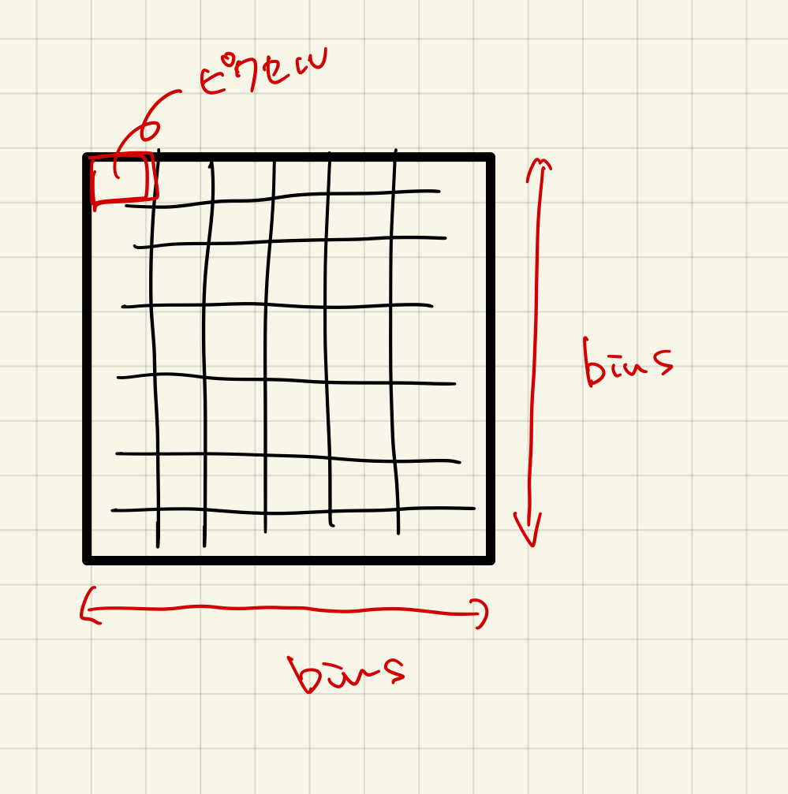
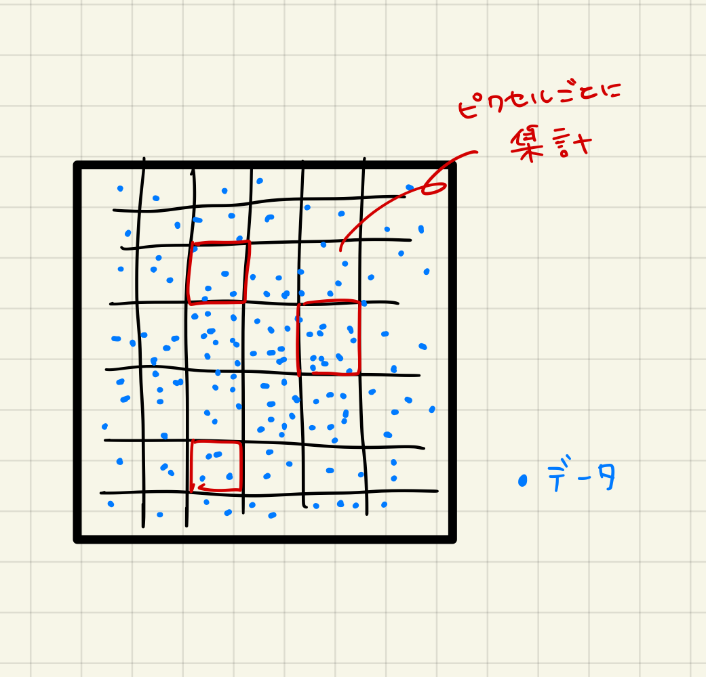
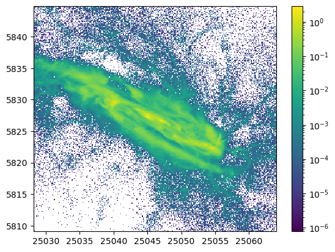
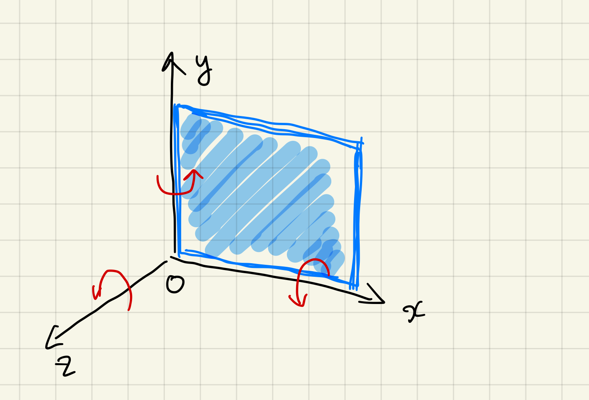
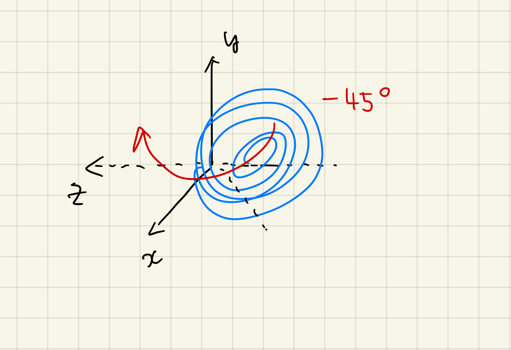
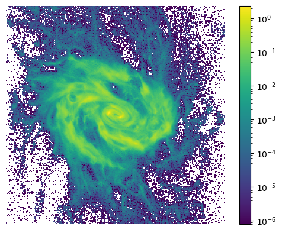
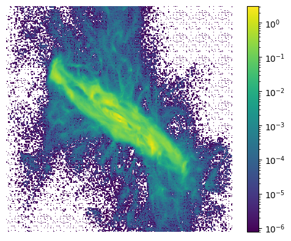
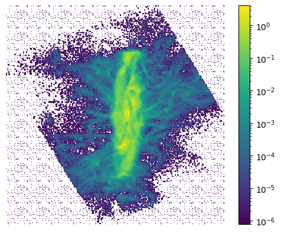
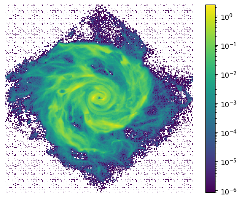



[TNG_catcher](../tng_catcher)/[TNG_catcher.plot_tools](../tng_catcher.plot_tools/)

---

次の一行でモジュールを読み込みます。

```python
from TNG_catcher import *
```

このモジュールは次のクラスが定義されてあります。

- extract_subhalo_data
- （順次作成中）

## はじめに

そこでこれらを簡単に取得したい／解析したいと思い、このモジュールを作成しました。


### 解析データの挿入（インスタンスの作成）

```python
import numpy as np

dd = np.load("data.npz")
test = plot_tools(dd)
```

インスタンスを作成するにあたり、読み込むのはNpzFileです。`extract_subhalo_data`クラスなどで出力したものを使用します。独自に抽出したデータでも構いません。

### 簡易描画する

「しっかり描画したい」とき、「簡易的に描画したい」ときというのがあると思います。

例えば、どんな概形かを知れればよく、解析途中であるときというのは、描画はなるだけ簡易的であるほうがいいです。そういうような場合は、`simple_plot()`メソッドを使いましょう。容量はあまり使わず、時間をかけずに描画できるように設計しています。

#### `simple_plot()`メソッド

`simple_plot()`メソッドは、`matplotlib.pyplot`モジュールを使って、簡易的に描画します。

```python
test.simple_plot('x','y','Density')
```

引数に使用できるのは、NpzFileに含まれるキーです。

次のコマンドで使用できるキーを確認してください。

```python
dd.files
```

また、独自に抽出したデータを使用する場合は、`dd.files`と同じように、キーを確認し、使用するキーのデータは1次元であることを確認してください。


#### パラメータ

```python
test.simple_plot(x, y, z, bins=301, log=True, fast=False, savefig="")
```

- `x`: x軸に使用するキー *(array_like, shape (N,))*
- `y`: y軸に使用するキー *(array_like, shape (N,))*
- `z`: z軸に使用するキー *(array_like, shape (N,))*
- `bins`: ピクセル数 *(int, default: 301)*
- `log`: 対数軸にするかどうか *(bool, default:`True`)*
- `fast`: 速度を優先するかどうか *(bool, default:`False`)*
  - `False`のときは、`pcolormesh`を使用。
  - `True`のときは、`imshow`を使用。
- `savefig`: 画像を保存するかどうか *(str, default: `""`)*
  - `""`のときは、保存しない。
  - 保存するときは、ファイル名を指定する。
  - 同じファイル名の場合は、上書きせずに、連番をつけて自動的に保存します。

#### 動作原理

`numpy.histogram2d`を使用して、データを2次元配列に変換して描画を行う。



デフォルトでは300×300に設定してある。

Pythonの仕様により、`bins=301`と+1されている。



このとき、集計する際にそれぞれの点では重み付けを行う。

この重み付けに使用するのが、パラメータの`z`である。

つまり、ラスタライズ画像を生成しているのに他ならない。

#### 白塗りを消したい

データ量が少ない(=ログを取れない)箇所に白塗りが出てしまうことがあります。これは少しダサイので、消したいと思います。

```python
from matplotlib.colors import SymLogNorm
x,y,z = dd['x'], dd['y'], dd['Density']
bins = 801
xbins = np.linspace(x.min(), x.max(), bins)
ybins = np.linspace(y.min(), y.max(), bins)
hist, xed, yed = np.histogram2d(x, y, bins=(xbins, ybins), weights=z)
plt.imshow(hist.T, origin='lower', norm=SymLogNorm(linthresh=hist[hist>0].min(),vmin=hist[hist>0].min(), vmax=hist.max()))
plt.axis("off")
plt.colorbar()
plt.savefig("cg_sub.png",dpi=400)
```


### 観測対象を回転させる

観測対象によっては、以下のように回転させたほうが見やすい場合があります。

背景はデータ数が少ない（ログをとることによって、値を定められない）箇所になります。バージョンによっては、これが解消されています。

```python
test.simple_plot('x','y','Density')
```



#### `rot_x()`, `rot_y()`, `rot_z()`メソッド

これらのメソッドは、`dd.files`に含まれるキー内に「x」,「y」,「z」のすべて存在する場合に利用できます。

先程、プロットした図は横軸にx軸、縦軸にy軸をとっているので、次のような座標系になります。



それゆえ、銀河は次のような位置にあることになり、おおよそy軸に対して-45°すればいいことも分かります。



この場合、`rot_y()`メソッドを使用します。

```python
test.rot_y(-45)
```

これによって、インスタンス`test`内の座標系が回転されました。

```python
test.simple_plot('x','y','Density',fast=True)
```



再度、xy平面をプロットしてみると、銀河が45°回転していることが分かります。そして、もう少し別の軸を回転したほうが良さそうです。そこで、zy平面をプロットしてみます。

```python
test.simple_plot('z','y','Density',fast=True)
```



今度は、x軸に対して60°回転したほうが良さそうです。そこで、`rot_x()`メソッドを使用します。

```python
test.rot_x(60)
test.simple_plot('z','y','Density',fast=True)
```



いい感じに回転ができました。

```python
test.simple_plot('x','y','Density',fast=True)
```




#### `save_rot()`メソッド

今回の観測対象に作用させた回転行列を保存することができます。保存するには`save_rot()`メソッドをしようします。

引数にはファイル名を書きます。

保存形式は`npy`形式です。

拡張子は含めても含めなくてもどちらでも構いません。

```python
test.save_rot("rotation_data")
```

インスタンス内で回転動作を記録しており、それを出力時に回転行列に変換しています。

### faceonにする

#### set_faceon() メソッド


### 温度を計算する


#### `get_temp()`メソッド

温度を計算するには、`get_temp()`メソッドを使用します。

これを計算するには次のキーが必要です。
- ElectronAbundance
- InternalEnergy

```python
test.get_temp()
```

計算結果は、インスタンス内に保存されます。また、この関数は温度データを返します。

#### パラメータ

```python
test.get_temp()
```

- `return`: `Temperature` *(array_like, shape (N,))*

### インスタンス内データを表示する

#### `show()`メソッド

一括ですべての表示するには、`show()`メソッドを使用します。

```python
test.show()
```


### インスタンスを保存したい

計算をしたり、回転行列を作用させたとき、そのままの状態で保存したいときがあるかと思います。

そのときは`save_npz()`メソッドを利用しましょう。

どのような回転作用を与えたかだけを保存したい、すべては保存したくないようなときは`save_rot()`メソッドが有効です。

#### `save_npz()`メソッド

引数にはファイル名を書きます。

保存形式は`npz`形式です。

拡張子は含めても含めなくてもどちらでも構いません。

```python
test.save_npz('converted_data')
```

メソッド内では、`numpy.savez`が動いているだけです。

---

$$
R_x(\theta) = 
\begin{pmatrix} 
1 & 0 & 0 \cr
0 & \cos\theta & -\sin\theta \cr
0 & \sin\theta & \cos\theta
\end{pmatrix}
$$

$$
R_y(\theta) =
\begin{pmatrix}
\cos\theta & 0 & \sin\theta \cr
0 & 1 & 0 \cr
-\sin\theta & 0 & \cos\theta
\end{pmatrix}
$$

$$
R_z(\theta) =
\begin{pmatrix}
\cos\theta & -\sin\theta & 0 \cr
\sin\theta & \cos\theta & 0 \cr
0 & 0 & 1
\end{pmatrix}
$$

