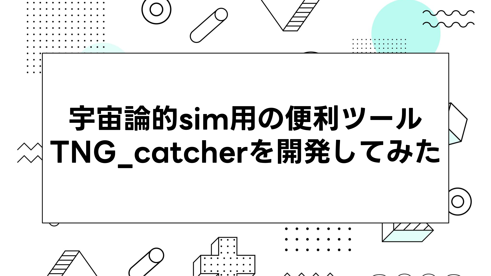

[TNG_catcher](../tng_catcher)

---

## 開発経緯

Illustris-TNGを用いたシミュレーションデータを単純に自分がもっと便利に楽に解析したいと思ったから。

[Illustris-TNGのホームページ](https://www.tng-project.org/)


## インストール



TNG_catcherはライブラリを読み込んだ段階で次のモジュールを自動で読み込みます。

```python
import illustris_python as il
import numpy as np
import pandas as pd
import os
import matplotlib.pyplot as plt
from matplotlib.colors import LogNorm
```


## 使い方

- [extract_subhalo_data](../tng_catcher.extract_subhalo_data)<br> subhaloデータを抽出したいときに使用します
- [plot_tools](../tng_catcher.plot_tools)<br>抽出されたデータを解析するのに使用します
- [manage_subhalo](../tng_catcher.manage_subhalo)<br>subhaloデータを管理するのに使用します

## ライセンス

```
MIT License

Copyright (c) 2023 Daisuke NISHIHAMA

Permission is hereby granted, free of charge, to any person obtaining a copy
of this software and associated documentation files (the "Software"), to deal
in the Software without restriction, including without limitation the rights
to use, copy, modify, merge, publish, distribute, sublicense, and/or sell
copies of the Software, and to permit persons to whom the Software is
furnished to do so, subject to the following conditions:

The above copyright notice and this permission notice shall be included in all
copies or substantial portions of the Software.

THE SOFTWARE IS PROVIDED "AS IS", WITHOUT WARRANTY OF ANY KIND, EXPRESS OR
IMPLIED, INCLUDING BUT NOT LIMITED TO THE WARRANTIES OF MERCHANTABILITY,
FITNESS FOR A PARTICULAR PURPOSE AND NONINFRINGEMENT. IN NO EVENT SHALL THE
AUTHORS OR COPYRIGHT HOLDERS BE LIABLE FOR ANY CLAIM, DAMAGES OR OTHER
LIABILITY, WHETHER IN AN ACTION OF CONTRACT, TORT OR OTHERWISE, ARISING FROM,
OUT OF OR IN CONNECTION WITH THE SOFTWARE OR THE USE OR OTHER DEALINGS IN THE
SOFTWARE.
```
---
[TNG_catcherに関連する記事一覧](../../categories/tng_catcher)